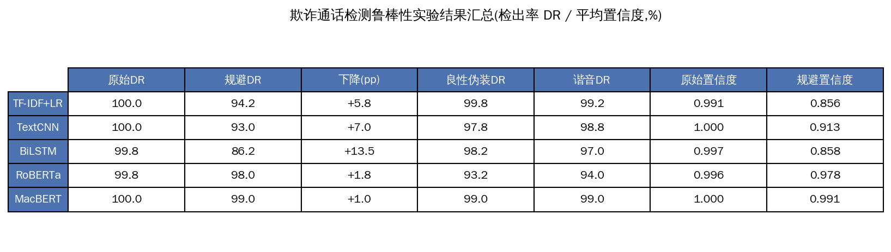
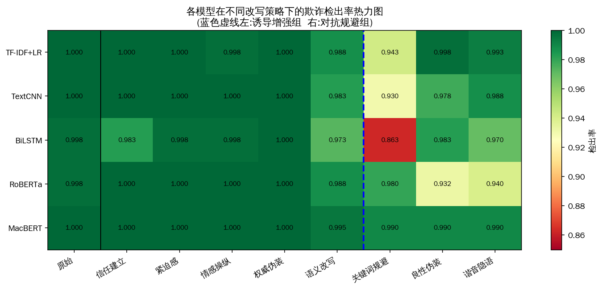
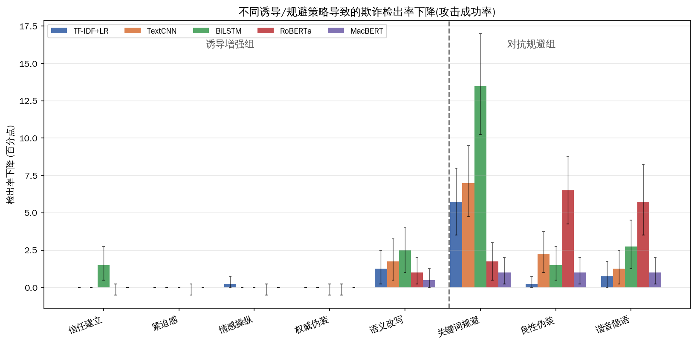
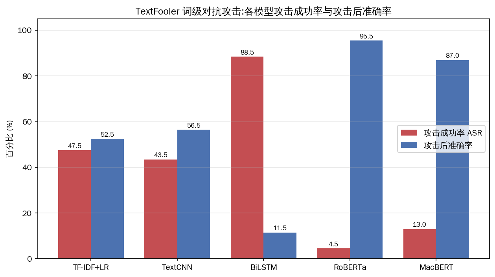
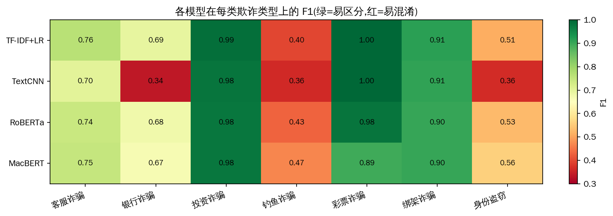

# 欺诈通话检测与社会工程诱导鲁棒性分析

> 机器学习课程大作业 · 基于 [Fraud-R1 (ACL 2025 Findings)](https://arxiv.org/abs/2502.12904) 思路的多策略语义改写攻击研究

本项目构建并横向对比了**五类监督学习欺诈通话分类模型**(传统机器学习 / 深度学习 / 预训练语言模型),并从两个互补维度评估其鲁棒性:**(1)** 参考 Fraud-R1 的多轮增强诱导思想,设计**诱导增强**与**对抗规避**两组共**八种 LLM 语义改写策略**;**(2)** 实现经典 **TextFooler 自动化词级对抗攻击**(中文离线适配)。此外,针对二分类过于简单的问题,还构建了更具挑战性的**欺诈类型 7 分类**任务。所有鲁棒性评估均在不重新训练的前提下进行。

## 核心发现

| 发现 | 结论 |
|------|------|
| **诱导增强 ≠ 击穿检测器** | 信任建立/紧迫感/情感操纵/权威伪装几乎不降低检出率,甚至因关键词密度上升而**更易被检出** |
| **对抗规避才是真威胁** | 关键词规避使最脆弱的 BiLSTM 检出率从 99.8% → **86.2%**(↓13.5pp) |
| **TextFooler 交叉印证** | 仅替换 **8.6%** 的词即攻陷 **88.5%** 的 BiLSTM 样本,而 RoBERTa 的 ASR 仅 **4.5%** |
| **鲁棒性代际分层** | MacBERT ≈ RoBERTa ≫ TF-IDF ≈ TextCNN > BiLSTM,深层语义模型最稳健 |
| **二分类太简单,类型分类才见真章** | 是否欺诈二分类 F1≈1.000,但欺诈类型 7 分类最优 Macro-F1 仅 ~0.75 |
| **置信度比硬标签更敏感** | 标签未翻转时,置信度已先行下滑,暴露决策边界裂缝 |

> 关键洞见:**社会工程诱导针对"人"的认知弱点,而文本检测器是冷静的旁观者——二者的脆弱面正交。** 提升话术对人的迷惑性,反而强化了检测器赖以判别的特征。



## 模型性能(原始测试集)

| 模型 | Accuracy | Precision | Recall | F1 |
|------|:--------:|:---------:|:------:|:--:|
| 逻辑回归 (TF-IDF) | 0.9996 | 0.9993 | 1.0000 | **0.9996** |
| 线性 SVM (TF-IDF) | 0.9996 | 0.9993 | 1.0000 | **0.9996** |
| 随机森林 (TF-IDF) | 0.9980 | 0.9964 | 1.0000 | 0.9982 |
| 朴素贝叶斯 (TF-IDF) | 0.9976 | 0.9957 | 1.0000 | 0.9978 |
| TextCNN | 0.9996 | 0.9993 | 1.0000 | **0.9996** |
| BiLSTM + Attention | 0.9992 | 0.9993 | 0.9993 | 0.9993 |
| RoBERTa-wwm-ext | 0.9988 | 0.9993 | 0.9986 | 0.9989 |
| MacBERT | 0.9996 | 0.9993 | 1.0000 | **0.9996** |

## 鲁棒性实验(欺诈检出率 %,400 条改写样本)

| 模型 | 原始 | 信任 | 紧迫 | 情感 | 权威 | 改写 | **规避** | 良性伪装 | 谐音 |
|------|:----:|:----:|:----:|:----:|:----:|:----:|:--------:|:--------:|:----:|
| TF-IDF+LR | 100.0 | 100.0 | 100.0 | 99.8 | 100.0 | 98.8 | **94.2** | 99.8 | 99.2 |
| TextCNN | 100.0 | 100.0 | 100.0 | 100.0 | 100.0 | 98.2 | **93.0** | 97.8 | 98.8 |
| BiLSTM | 99.8 | 98.2 | 99.8 | 99.8 | 100.0 | 97.2 | **86.2** | 98.2 | 97.0 |
| RoBERTa | 99.8 | 100.0 | 100.0 | 100.0 | 100.0 | 98.8 | 98.0 | **93.2** | 94.0 |
| MacBERT | 100.0 | 100.0 | 100.0 | 100.0 | 100.0 | 99.5 | 99.0 | 99.0 | 99.0 |




## TextFooler 自动化词级对抗攻击(200 条欺诈样本)

经典 TextFooler(Jin et al. 2020)的中文离线适配:`jieba` 词重要性排序 + 本地 MacBERT 掩码语言模型生成同义候选 + 词性/句向量约束 + 贪心替换。**ASR** 越高、**攻击后准确率**越低,模型越脆弱。

| 模型 | ASR (%) ↑ | 攻击后准确率 (%) | 扰动率 (%) | 平均查询数 |
|------|:---------:|:----------------:|:----------:|:----------:|
| TF-IDF+LR | 47.5 | 52.5 | 14.0 | 717.6 |
| TextCNN | 43.5 | 56.5 | 10.5 | 790.5 |
| BiLSTM | **88.5** | **11.5** | **8.6** | 483.8 |
| RoBERTa | **4.5** | **95.5** | 4.6 | 740.9 |
| MacBERT | 13.0 | 87.0 | 12.8 | 711.6 |

> 与 LLM 改写结论**殊途同归**:浅层模型(尤其 BiLSTM)在词级扰动下不堪一击,预训练模型则极为鲁棒。



## 欺诈类型多分类(7 类,欺诈样本子集)

二分类对所有模型都太简单(F1≈1.000),无法拉开差距。在欺诈样本上构建的**欺诈类型 7 分类**任务难度显著提升,且类别高度不均衡(客服诈骗 2609 vs 身份盗窃 134)。

| 模型 | 准确率 | Macro-F1 | Weighted-F1 |
|------|:------:|:--------:|:-----------:|
| 逻辑回归 (TF-IDF) | 0.768 | **0.752** | 0.767 |
| TextCNN (字符级) | 0.647 | 0.664 | 0.636 |
| RoBERTa-wwm-ext | 0.743 | 0.748 | 0.754 |
| MacBERT | 0.746 | 0.745 | 0.751 |

> 投资/彩票/绑架诈骗因有专属强特征而易区分(F1≈0.9~1.0),客服诈骗与银行诈骗语义高度重叠、互相误判,钓鱼诈骗最难(F1 仅 ~0.4)。逻辑回归凭 TF-IDF 即与预训练模型相当,说明类型区分仍较依赖关键词线索;TextCNN 受限于字符级建模而最弱。



## 项目结构

```
fraud_detection/
├── src/
│   ├── data/
│   │   ├── preprocess.py        # 数据清洗、标签补全、分层划分
│   │   └── eda.py               # 探索性数据分析与可视化
│   ├── models/
│   │   ├── traditional_ml.py    # TF-IDF + 逻辑回归/SVM/随机森林/朴素贝叶斯
│   │   ├── deep_models.py       # TextCNN / BiLSTM+Attention
│   │   ├── bert_finetune.py     # 中文 RoBERTa / MacBERT 微调(二分类)
│   │   └── fraud_type_clf.py    # 欺诈类型 7 分类(传统/深度/BERT)
│   ├── rewrite/
│   │   ├── fraud_r1_rewrite.py  # Fraud-R1 风格 8 策略语义改写(DeepSeek API)
│   │   ├── evaluate_robustness.py # 鲁棒性评估(检出率 + 置信度)
│   │   └── textfooler_attack.py # TextFooler 词级对抗攻击(中文离线适配)
│   └── utils/
│       ├── plot_results.py      # 鲁棒性结果可视化
│       ├── plot_fraud_type.py   # 欺诈类型多分类可视化
│       ├── plot_textfooler.py   # TextFooler 攻击结果可视化
│       ├── summary_table.py     # 结果汇总表
│       └── make_screenshots.py  # 运行截图生成
├── data/
│   ├── processed/               # 清洗后的 train/val/test
│   └── rewritten/               # 8 种策略改写后的测试集
├── outputs/
│   ├── figures/                 # 所有图表与运行截图
│   ├── results/                 # JSON 结果与训练日志
│   └── models/                  # 训练好的模型权重
├── paper/
│   ├── main.tex                 # 论文 LaTeX 源码
│   ├── main.pdf                 # 编译后的论文(19 页)
│   └── references.bib           # 参考文献
├── requirements.txt
└── run_all.sh                   # 一键复现脚本
```

## 快速开始

```bash
# 1. 安装依赖
pip install -r requirements.txt

# 2. 设置 DeepSeek API 密钥(用于 Fraud-R1 风格改写)
export DEEPSEEK_API_KEY="your-key"

# 3. 一键运行全流程(数据→训练→改写→评估→出图)
bash run_all.sh
```

或分步运行:

```bash
python src/data/preprocess.py                                          # 数据预处理
python src/models/traditional_ml.py                                    # 传统 ML
python src/models/deep_models.py --arch textcnn --tag textcnn          # TextCNN
python src/models/bert_finetune.py --model hfl/chinese-roberta-wwm-ext --tag roberta
python src/rewrite/fraud_r1_rewrite.py --strategy all --sample 400      # 语义改写
python src/rewrite/evaluate_robustness.py                              # 鲁棒性评估
python src/utils/plot_results.py                                       # 可视化
```

## 数据集

课程提供的中文通话互动数据集(训练集 14,363 通 / 测试集 2,677 通),清洗后训练 12,273 / 验证 1,364 / 测试 2,552 通,欺诈占比约 54%。每通对话含主叫(`left`)与受话(`right`)多轮交互,标注是否欺诈、欺诈类型、互动策略等。

## 运行环境

- Python 3.10+,PyTorch 2.x,Transformers 4.40+
- GPU:NVIDIA RTX 5090(24GB),CUDA 可用
- 预训练模型:`hfl/chinese-roberta-wwm-ext`、`hfl/chinese-macbert-base`

## 模型权重

训练好的模型权重(约 790MB)未纳入版本库(见 `.gitignore`),需本地复现生成:

```bash
python src/models/traditional_ml.py     # 传统 ML,约 1 分钟(CPU)
python src/models/deep_models.py --arch textcnn --tag textcnn   # 约 2 分钟(GPU)
python src/models/deep_models.py --arch bilstm  --tag bilstm    # 约 3 分钟(GPU)
python src/models/bert_finetune.py --model hfl/chinese-roberta-wwm-ext --tag roberta   # 约 5 分钟(GPU)
python src/models/bert_finetune.py --model hfl/chinese-macbert-base     --tag macbert  # 约 5 分钟(GPU)
```

所有训练已固定随机种子(`seed=42`,含 `cudnn.deterministic` 与 DataLoader generator),在相同环境下可复现。预训练模型权重首次运行时自动从 HuggingFace Hub 下载。

## 复现性与统计严谨性

- **捷径诊断**(`src/data/shortcut_diagnosis.py`):验证高性能根因。结果显示 train/test 无泄漏,但单一关键词规则即可达 F1=0.73,而学习模型达 0.9996,说明模型在关键词之外还捕捉了话术结构特征。
- **改写意图保留校验**(`src/rewrite/verify_intent.py`):用 LLM 二次判定改写样本是否仍为欺诈,报告意图保留率,确保鲁棒性结论可信。
- **Bootstrap 置信区间**(`src/rewrite/evaluate_robustness.py`):对检出率下降做 2000 次配对自助重采样,给出 95% CI 与显著性标记。诱导增强组的下降统计不显著,对抗规避组显著。
- **错误案例分析**(`src/rewrite/error_analysis.py`):剖析被关键词规避翻转的 false negative 样本。

## 论文

完整论文见 [`paper/main.pdf`](paper/main.pdf),涵盖研究背景、相关工作、方法解读、实验分析与参考文献。所有实验图表采用 PDF 矢量图。

## 致谢

本项目方法设计参考自 Yang et al., *Fraud-R1: A Multi-Round Benchmark for Assessing the Robustness of LLM Against Augmented Fraud and Phishing Inducements*, ACL 2025 Findings.
